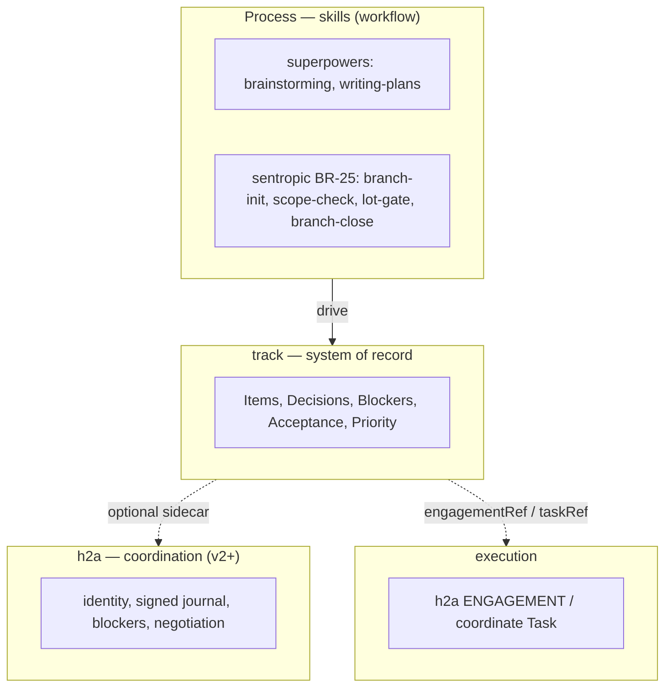
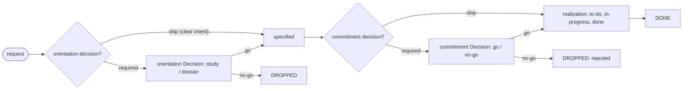

# INTENTION — `@sentropic/track`

> Status: **iterated intention, round 3** (2026-06-03). Hardened across two adversarial double-reviews (Opus 4.8 + Codex gpt-5.5 xhigh — archives `.review*-opus.md`, `.review*-codex.md`) and successive user model corrections.
> Boundary: **A — track is record-only, reuses h2a.** This document becomes `../track/INTENTION.md` on repo creation.
> Round-3 changes: decisions are first-class **linked items** (not a state on the specification axis); negative terminals; blockers are computed relations with explicit report precedence; prioritization is a versioned assessment (WSJF = one optional scheme); a formalized **study/brainstorm → orientation decision** phase (skippable); MVP event contract + BRANCH.md kept source-of-truth.

## Problem

The real need is a **typed product backlog** (feature/bug/chore requests) whose **acceptance criteria are tied to test evidence**, with a **computed status**, **optional prioritization**, and **formalized study/decision** — queryable and diffable. ⚠️ This is **not a green field**: `h2a` already industrializes the contractual chain `INTENTION → SPEC → ENGAGEMENT (charter + success criteria + signed journal)`. track does **not** re-model that; it adds the layer h2a **lacks** (typed backlog + criterion↔test mapping + computed acceptance + prioritization + formalized study/decision), **reusing** h2a's infrastructure.

## Boundary track ↔ h2a (concept-by-concept)

| track concept | relation to h2a | decision |
|---|---|---|
| `Item` (typed feature/bug/chore request) | h2a has no typed product backlog | **NEW** |
| specification axis | string/identifier homonym with h2a EVO-9 `INTÉRÊT/INTENTION` (a trust/conflict concept, not product-interest) | **NEW, identifiers disambiguated** |
| `AcceptanceCriterion` + `TestEvidence` + computed `acceptanceStatus` | h2a has "success criteria" but no typed test mapping | **NEW** |
| `WorkPackage` (work container) | = h2a `ENGAGEMENT` / coordinate `Task` | **DEGRADED to a derived view** — not stored; `engagementRef`/`taskRef` |
| transition journal / events | h2a = signed hash-chained append-only journal | **REUSED** when available; else local append-only jsonl, same shape |
| blockers | h2a has `blockage_raise/resolve/list` | **REUSED** when available; else local |
| packaging (CLI/MCP/skills) | h2a = `install-skills --host …` | **REUSED** |
| multi-agent coordination / consolidation | h2a = negotiation / transport / signature | **DELEGATED** (optional sidecar); domain-merge stays in track |

**Rule:** track runs **standalone**. When h2a is available, track delegates coordination/transport to it, never the model.

## Diagrams

**Ecosystem boundary** (who drives, who records, who coordinates, who executes):


**Item lifecycle** (request → optional orientation study → spec → optional commitment → realization → report):


## Canonical model

A regular `Item` carries **three orthogonal state axes**, plus **blockers** (relations, not an axis), plus **priority assessments**. **Decisions are themselves items** (`kind: decision`), linked to their targets.

```
Item { id, kind: feature|bug|chore|decision, title, body,
       workspace, parent?, links[], engagementRef?, taskRef? }
```

**Axis 1 — Specification** (is the request *defined*?) — pure definition, no decision here:
```
to-specify → specified
```
Human labels ≈ *interest → intention → spec*; identifiers disambiguated from h2a EVO-9. *(Round-3: `decided` removed from this axis — a fully-specified request can still be decided NO; commitment is a linked Decision, not a definition state.)*

**Axis 2 — Realization** (is the work *done*?) — *the `report` axis*, with negative terminals:
```
to-do → in-progress → done
            └────────────→ cancelled | rejected      (negative outcome of a Decision)
```
track holds this **high-level** status (record); detailed execution stays outside (`ENGAGEMENT` h2a / `Task` coordinate).

**Axis 3 — Acceptance** (computed, revocable) — distinct from realization-`done`:
```
AcceptanceCriterion → TestEvidence{ kind: unit|integration|e2e|manual, locator }
                    → TestRun{ commit, env, runner, result: pass|fail, at }
acceptanceStatus = pass | fail | unknown | stale | waived
```
`waived` is **not a test result** — it is a tracked **exception/decision** that overrides the computation (manual UAT, deliberate waiver). Revocable (a test going red regresses). A **derived view**, not an automatic gate (`lot-gate` already does a degraded per-run version). `done` (realization) ≠ `accepted` (acceptance) — kept distinct.

**Blockers — append-only computed open *relations* (annotations, NOT a 4th axis):**
```
Blocker { id, target: ItemId, kind: decision | dependency,
          ref: ItemId, owner, reason, resolutionRule, openedAt, resolvedAt? }
```
- `decision`: target awaits a linked `Decision` item → resolves when that decision's `outcome ≠ pending`.
- `dependency`: blocked by another Item → `resolutionRule` states *when it clears* (linked realization `done`, or acceptance `pass`, or decision settled, or manual).

**Decisions — first-class linked items** (`kind: decision`):
```
Decision (Item, kind:decision) {
  decisionKind: orientation | commitment | other,
  targets: ItemId[],
  dossier: Dossier,
  outcome: pending | go | no-go | deferred }
Dossier { context, options[], questions[], answers[],
          recommendation, rationale, decisionEvaluation? }   // formalized study/Q&A
```
A Decision has its **own realization axis** — *its prep work (study/brainstorm/Q&A) IS its realization*. While `outcome = pending`, it manifests as an **open `decision` blocker** on each target. On resolution: `go` → target proceeds; `no-go` → target realization `cancelled`/`rejected`.

**Prioritization — versioned assessment, optional, pluggable** (never set in stone):
```
PriorityAssessment (append-only event) { schemeId, schemeVersion, inputs, score, order?, at }
Item.priority   = the LATEST PriorityAssessment   // live, re-rankable → backlog sort
decisionEvaluation = a FROZEN PriorityAssessment snapshot embedded in a Dossier   // inspectable evidence of WHY decided
```
WSJF = one **provided** scheme: `score = (userBusinessValue + timeCriticality + riskReduction|opportunityEnablement) / jobSize`. Not opaque, **not hardcoded** on any axis, used only when active. Other schemes (RICE/MoSCoW/manual rank) later.

**Derived**: `WorkPackage` = grouping of Items + refs (not stored); agile projection (`Epic/Feature/UserStory/PI`) = lean external mapping, out of core.

## Study & orientation decision (pre-spec — quasi-systematic, skippable)

Before a request becomes `specified`, it usually needs a **study/brainstorm**: a structured **Q&A exploration of options** leading to an **orientation decision** ("which direction?"). This reclaims the strength of the superpowers `brainstorming` skill and **formalizes** it.

- Modeled as an **orientation `Decision`** (`decisionKind: orientation`) targeting the request. Its **prep work (the Q&A/study) is its realization**; its **dossier** records context / options / questions / answers / recommendation / rationale / outcome.
- While `pending`, it raises a `decision` blocker on the request → **AWAITED**. Resolved → the request may proceed to `specified`, shaped by the chosen orientation.
- **Skippable** when the intention is very clear (skip study → straight to spec).
- **Separation:** the superpowers `brainstorming` skill **drives** the Q&A (process); track **records** the dossier (record). A `decide` skill similarly drives `commitment` decisions. A `commitment` (go/no-go) Decision typically sits **after** spec, before realization.

## `report` view (read-only, computed) — explicit precedence

Buckets, evaluated **in order** (first match wins):
1. **AWAITED** — has any open blocker (`decision` or `dependency`). *(open blocker dominates, even mid-`in-progress`)*
2. **DROPPED** — realization `cancelled`/`rejected` *(negative outcome — surfaced, never silently counted as TO-DO)*
3. **DONE** — realization `done` (and, if the install configures it, acceptance `pass`)
4. **TO-DO** — everything else (`to-do`/`in-progress`)

≈ your *attendus / —  / fait / à faire*, with DROPPED added so no-go items are not stranded. Sorted by the active prioritization scheme when present. Pure projection — included in **MVP**.

→ **Connectors** (external backends) and **screens** (UI like the `../immo` backlog) = **v2+**.

## Persistence (foundational, frozen)

- Append-only **event contract** (core types below; **finalized in SPEC**, incl. study/skip/dossier/waiver events): `item.created`, `spec.transition`, `realization.transition`, `acceptance.run`, `acceptance.waived`, `blocker.opened/resolved`, `decision.outcome`, `decision.disposition`, `dossier.revised`, `priority.assessed` — each with stable `id`, `revision`, `contentHash`. Stored as `.track/*.jsonl`, **append-only** (not mutable YAML frontmatter), deterministic merge policy, per-field ownership. Aligned with h2a's append-only + lease-lock.
- Hybrid: **prose** (spec/uat/dossier) in markdown; the **event log/sidecar** carries structure. Explicit round-trip contract.
- **MVP: `BRANCH.md` stays the source of truth** (lot-gate mutates its checkboxes; branch-close needs its exact body). The track sidecar is a **derived/secondary index** that reads + annotates `BRANCH.md`, **not** a master. No fight over ownership; skill migration is a later, explicit decision.
- External backends (Jira/GitHub/VersionOne/Azure) = out of MVP.

## Coordination, coherence & consolidation (h2a = optional sidecar)

- The **LLM PROPOSES, never DECIDES** coherence. Reconciliation = deterministic rules first (canonical JSON, hash, revision vector, dry-run, conflict types, write rights, audit, human approval, rollback); the LLM is a non-blocking proposal. (Aligned with h2a REQ-054.)
- `llm-mesh` + multi-repo consolidation = **v2+**.

## Decision & presentation

- **Decision** modeling: see above (first-class linked `Decision` items; orientation & commitment kinds; dossier). Binding (authority + signature) → **h2a negotiation** (v2+). No separate `@sentropic/decide` module.
- **Presentation** (web page, pptx, md, …) = a **separate rendering layer**: pluggable renderers/skills that *consume* track. Out of core.
- **UI integration (v2+, ecosystem principle)**: track screens (starting with `report`, and decision **dossiers**) = **Svelte components aligned to the design system** (`@sentropic/design-system-svelte`), **embeddable as views in sentropic** — same contract as h2a screens and graphify outputs. Argues for a **shared embeddable-view contract** (defined once on the design system), consumed by track / h2a / graphify / sentropic. Cross-cutting `coordinate`-level decision, out of track MVP.

## Distribution

- **Standalone `track` CLI first** (repo/dir `../track`, package `@sentropic/track`).
- **MCP + per-host skill bundles**: after a stable model, **reusing** h2a's `install-skills`/host mechanism; one CLI/MCP contract → no per-host drift.
- `stp track`: registered after BR-42a ships the sub-command mechanism.

## Anticipated h2a evolutions (do NOT file now — post-MVP, `lib-evolution-request`)

1. Journal: append an event correlated to an **external work item** (track `Item.id`).
2. Packaging: make `install-skills`/host **reusable by a third-party lib** (track).
3. Coordination: a **lightweight consultation / decision-prep** primitive below a full signed negotiation.

## MVP (descoped, h2a-free)

`docs-git` + typed schema + frozen event contract + `validate`/`query`/**`report`** + **`BRANCH.md` import/annotate (BRANCH.md stays master)** + a single host via CLI + **zero** external backend + **zero** llm-mesh. Studies/decisions recordable locally; `decision` blocker resolved by a **local manual flag** in MVP (h2a negotiation is v2+).

**Milestone 1:** *"existing `BRANCH.md` → track sidecar (derived index) → `scope-check`/`lot-gate` can read track; `report` renders done/to-do/awaited/dropped."*

## Non-goals (v2+)

llm-mesh / LLM coherence · multi-repo consolidation · external backends · MCP server · multi-host plugins · UI / Svelte DS screens in sentropic (UX ref: `../immo` backlog) · presentation renderers · real-time sync · binding decisions via h2a negotiation.

## Model refinements pinned for the SPEC (round-3 double review — both reviewers converged)

The SPEC MUST close these (none is direction-level — all are precise model semantics):
1. **Decision items are specialized**: for `kind:decision`, the specification & acceptance axes are **n/a** (collapsed) — a Decision uses only realization (its prep) + `outcome`. Decisions are **excluded from default `report`** (`--decisions` to include).
2. **Recursion guard**: a `Decision` MUST NOT target another `Decision` (acyclic) — no decision-needing-a-decision regress.
3. **Realization `done` ≠ `outcome` settled**: a Decision's prep can be `done` while `outcome` is `pending`; completion = prep done **and** outcome set.
4. **`outcome → terminal` + `deferred`**: `no-go` → target realization `rejected` (refused) vs `cancelled` (withdrawn) — define the selector; `deferred` does **not** resolve the blocker (target stays AWAITED), so blocker resolution keys on `outcome ∈ {go, no-go}`, not merely `≠ pending`.
5. **Gate disposition is recordable**: orientation & commitment each carry a disposition `required | skipped | not-applicable | completed` with explicit events — "skipped" must be queryable, never indistinguishable from "forgotten".
6. **Dossier typed**: `options[]` with IDs, `selectedOptionId`, joined Q&A (not parallel arrays), `outcome` lives on the `Decision` (single source), recommendation links to the chosen option + the resulting spec change.
7. **Event contract extended**: study/skip, dossier revisions, `acceptance.waived`; a target `realization.transition` caused by a decision is an **emitted/derived** event, not a silent mutation (preserves append-only).
8. **Blockers**: reuse h2a's `raise/list/resolve` **mechanism**, but track owns the **product-item** semantics (h2a blockage is agent/session-level). The MVP `decision` blocker is resolved by the Decision's `outcome` — not a separate "manual flag" (no double source).
9. **BRANCH.md ownership**: track **annotates via its own sidecar**, never mutates `BRANCH.md` (which stays master, owned by `lot-gate`/`branch-close`).

## Open questions

1. Final labels of the specification axis (`to-specify → specified`) + the disambiguated identifiers vs EVO-9.
2. Prose↔event-log round-trip contract: regeneration rule + desync detection.
3. CI → `acceptance.run` bridge: how `lot-gate`/`make test` push results into the event log.
4. `report` DONE policy: does DONE require acceptance `pass`, or is realization-`done` enough (configurable)? Name the toggle.
5. Dependency `resolutionRule` default (linked `done` vs acceptance `pass`).

## Validated (keep)

CLI-first · three separated axes · acceptance as revocable computed view, distinct from done · decisions as first-class linked items · study/brainstorm formalized & skippable · lean agile projection out of core · prioritization optional/versioned · BRANCH.md kept master in MVP · append-only event log · no UI in MVP.

## Next step

Pipeline: iterate ✔ → double review round 3 (Opus + Codex) → create repo `../track` + commit this INTENTION → write SPEC + PLAN → double review → commit → uncommitted `HANDOVER.md`.
