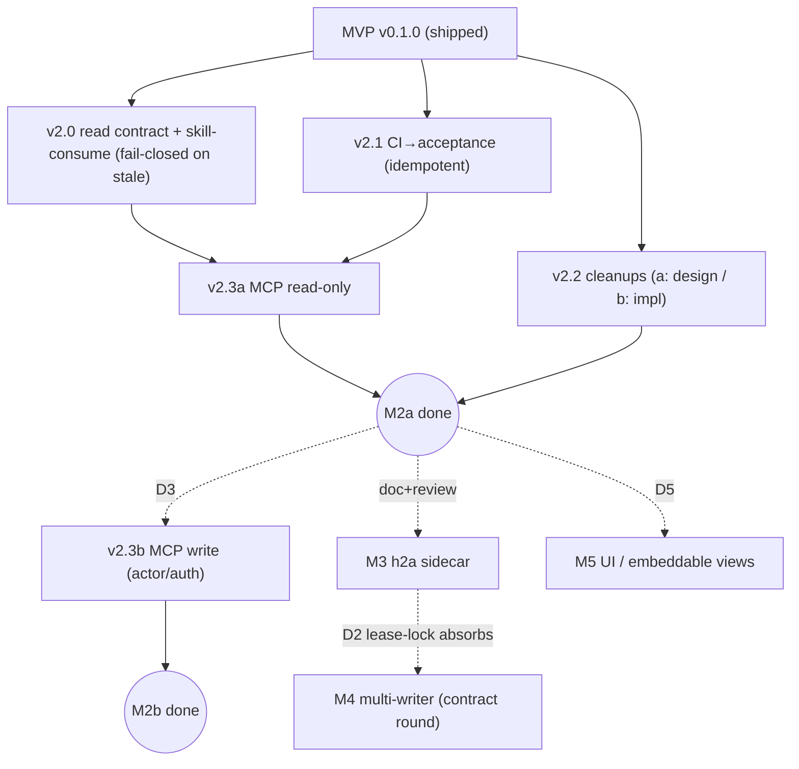

# PLAN v2 — `@sentropic/track` (post-MVP)

> Successor to [`PLAN.md`](./PLAN.md) (MVP, Lots 0–7, shipped & published `@sentropic/track@0.1.0`). Same method: **PLAN → TDD → per-lot double review (Codex gpt-5.5 xhigh + Opus 4.8) → tests-green gate**. Grounded in [`../../INTENTION.md`](../../INTENTION.md) §"Non-goals (v2+)", §"Anticipated h2a evolutions", and [`../spec/SPEC.md`](../spec/SPEC.md) §9–§10.
>
> **Status: PROPOSAL — round-1 double review applied (`../reviews/plan-v2-r1-{codex,opus}.md`); awaiting user sign-off.** Nothing is built yet. The §"Decisions to settle" block lists the **non-reversible / direction-level** choices that are *yours*; everything else carries a **reversible default**.
>
> **Review verdict (both reviewers converged): approve-with-changes** → *build M2 read-side after the fixes below; MCP **writes** and **M4** are NOT approved as originally written* — M2 writes need the actor/auth decision (D3), M4 is reclassified as a new frozen-contract round.

## Prime directive (unchanged from MVP)

**track records, it does not coordinate or decide.** When h2a is present, track *delegates* coordination/transport/identity/signature to it as an **envelope around canonical track event frames** — track always owns the frames and the product-item semantics, and standalone emits the **same events**. The MVP event contract (`contentHash` + positional `prevHash` + per-aggregate contiguous `seq` + single `head.json` anchor, single global stream) is **frozen**. v2 may *append* event types and *add read surfaces* without touching it; **any change to the stream/seq/chain model is a new frozen-contract round** (Codex+Opus, Lot-1-grade) — not an ordinary lot.

## Milestones (risk-staged; "ascending risk" is not uniform — M2 itself is staged)

The MVP is published but **not yet consumed by anything**. v2 first makes it *used* and *reachable* with the **read side** (genuinely additive/reversible), then takes on each higher-risk surface behind its own gate. Note (per review): a public read-API freeze, CI **writes**, and MCP **writes** are *not* uniformly reversible — so M2 is **staged internally**, read-before-write.

| Milestone | Theme | Reversibility | Gate before starting |
|---|---|---|---|
| **M2a — Consumed (read)** | skills read track · MCP **read-only** · CI feeds acceptance · deferred cleanups | High (additive) | this plan approved |
| **M2b — Exposed (write)** | MCP **write** tools · skill write-back (if any) | **Medium** (security posture) | **D3** (actor/auth) settled |
| **M3 — Coordinated** | h2a sidecar (envelope/transport/signature over track frames) · binding decisions via negotiation | Medium (cross-repo, needs h2a evolutions) | M2 + **D4** + h2a roadmap aligned |
| **M4 — Concurrent** | multi-writer — **new frozen-contract round** | **Low** (re-models the frozen stream) | **D2** settled + contract-round design doc passes Lot-1-grade review |
| **M5 — Surfaced** | Svelte design-system screens (`report`, dossiers) + shared embeddable-view contract | Medium (cross-cutting `coordinate`-level) | **D5** settled with design-system owner |
| **Later** | external backends · presentation renderers · llm-mesh / multi-repo consolidation · scheme registry beyond WSJF · `stp track` sub-command · prose↔log **regeneration** | n/a | own plan |

Recommendation: **commit M2a now**; M2b after D3; M3/M4/M5 are design-doc-first. Under the recommended **D2 default (lease-lock)**, **M4 largely collapses into M3** (a single writer per lease = the frozen single-stream contract already holds); a real in-track merge is pursued *only if* a future need outweighs its contract-round cost.

## Stack additions (decided here, all reversible)

- **Command layer (prereq for MCP):** extract the existing CLI verb table into a **transport-agnostic command layer** that owns **no `git` and no `fs`** — today `report`/`query`/`item ls` reach git HEAD via `execFileSync('git', …)` in `cli/index.ts`; that must move to the **adapter**. The command layer takes **injected inputs**: `{ baselineCommit, fileContent, clock, idgen, actor }`. CLI and MCP become thin adapters that supply those. *(No new domain logic — pure surface refactor; enables both parity testing and side-effect-free reads.)*
- **MCP:** `@modelcontextprotocol/sdk` (stdio first). One shared command contract → no per-host drift.
- **CI bridge:** GitHub Actions step calling `track accept run --from <report> --format junit|json` (the **existing** MVP ingest formats; TAP is *new scope* if wanted, not implied). No new runtime dep.
- **Multi-writer (M4):** default = **h2a lease-lock / single-writer-per-lease, no in-track merge** (pending **D2**); revision-vector + field-ownership merge is a *fallback only if the M4 contract round proves a deterministic convergent order*.
- **UI (M5):** Svelte + `@sentropic/design-system-svelte`, embeddable-view contract owned by the design system (pending **D5**).

---

## M2a — Consumed (read side)

### Lot v2.0 — Skill-consumption + frozen read contract
- **Deliver:** a **curated public read API** (not today's `export *`, which leaks internals) with an explicit `contractVersion` and an **additive-only** evolution rule; `scope-check`/`lot-gate` consume it (`report`/`query`/`validate`) **as a read overlay on `BRANCH.md`, which stays master** — lot-gate mutations remain on `BRANCH.md` only, track is never written by skills.
- **Stale-authority guard (review #5):** skill consumption MUST verify the sidecar is fresh — compare the **structural signature** of the current `BRANCH.md` (per-lot `done`, per-UAT `passed`, branchSlug; prose/title/order-invariant) against the latest valid `branch.imported.structureHash` for the locator; **fail closed** on stale, absent, malformed-latest-stamp, or `validate` desync (never let a stale sidecar become de-facto master). The latest stamp is authoritative — a malformed latest never falls back to an older one.
- **Tests:** contract **snapshot** test (breaking field change fails CI); golden fixture → stable JSON; a **stale-sidecar fixture fails closed**; zero writes to track from skills; `BRANCH.md` byte-hash unchanged.
- **Gate:** curated surface + version stamped; stale-guard proven; snapshot green.

### Lot v2.1 — CI → `acceptance.run` bridge (with idempotency as a real deliverable)
- **Deliver:** a GitHub Actions reusable step: run suite → emit `junit|json` → `track accept run --from … --commit $GITHUB_SHA`. **New deliverable (not existing behavior):** ingest **idempotency** — today `ingestRuns` appends unconditionally; skip a candidate run only when its result **equals the LATEST recorded result for `(evidenceId, commit, env, runner)`** (not a whole-history 5-tuple, which would drop a flaky test's recovery, nor the bare 4-tuple, which would drop the first result change). A true re-ingest is then a no-op, every genuine transition (incl. `pass→fail→pass`) is recorded, and `latestRun` never goes false-green on `fail→pass→fail`. Resolves INTENTION Open-Q 3, SPEC §10.
- **Tests:** junit + json fixtures flip criteria to `pass`/`fail`; `stale` vs `baselineCommit`; **re-ingest leaves event count stable** (idempotency); dogfood on **track's own CI**.
- **Gate:** idempotency test green; format restricted to `junit|json` (or TAP added as explicit scope); contract unchanged.

### Lot v2.2 — Deferred-item cleanups — *with a model sub-lot, not "small"*
- **Review #7:** these are **not** all trivial. `manual` resolutionRule **already exists**; `linked-accepted` is **baseline-commit-dependent**; `decision-settled` **changes what a dependency `ref` may target**. So:
  - **v2.2a (design sub-lot, no code):** specify dependency `resolutionRule` extensions (`linked-accepted`, `decision-settled`) with explicit **blocker-status recompute semantics** (when does the blocker re-open if acceptance regresses?) + baseline rules. Double-reviewed.
  - **v2.2b:** implement v2.2a; plus `report.requireAccepted` **per-workspace**; `validate` desync **surfaced with a fix-it hint** (still **never auto-repairs** — record-only); BRANCH-import gate **sub-checkbox** semantics.
- **Tests:** one focused test per item; `validate` asserted **pure** (no mutation); regression-recompute case for `linked-accepted`.
- **Gate:** frozen contract untouched; every behaviour additive + flagged.

### Lot v2.3a — MCP server (read-only)
- **Deliver:** `@sentropic/track` MCP server over the shared command layer, **read tools only** (`report`, `query`, `item show`, `validate`) — provably side-effect-free **because the command layer holds no git/fs** (commit + content are injected by the adapter). Stdio transport; packaged via h2a `install-skills` when available, standalone otherwise.
- **Tests:** list tools; read tool returns the **same normalized result** as the CLI for a fixture (parity via the shared layer + injected context — see gate wording below); reads perform **no append** (event-count invariant).
- **Gate:** read-only provably no-write; CLI≡MCP read parity green.

> **M2b (MCP write) is split out and gated on D3** — see below. It is *not* part of the M2a approval.

**M2a acceptance (merge gate):** v2.0–v2.3a green; track is consumed by ≥1 skill (fail-closed on stale), fed idempotently by CI, and **readable** over MCP — frozen contract and `validate` invariants intact.

---

## M2b — Exposed (write side) — *gated on D3*

### Lot v2.3b — MCP write tools
- **Deliver:** write tools (`item new/spec/realize`, `decision …`, `accept …`, `blocker …`, `priority assess`) each mapping 1:1 to an existing command + validator. **Security posture (review #3 / Opus M-D3):** an MCP host appends as some actor; the event `by` field today defaults to `'system'`, which would **mis-attribute every MCP write**. Writes therefore REQUIRE a **caller-supplied actor + capability gate + audit fields**, configured explicitly — this is the substance of **D3**, a non-reversible decision.
- **Parity gate (reworded — reviews #4 / M-PARITY):** "byte-for-byte" is untestable as written because events embed fresh `ulid()`/`new Date()` and path-based reads don't cross transports. Gate = **same command layer + injected deterministic context (id/clock/actor) ⇒ identical normalized event structure**; compare normalized events (content, not path), not raw bytes.
- **Gate:** actor attribution correct (no `'system'` default on MCP); capability gate enforced; append-only invariants hold under MCP writes; parity (normalized) green.

---

## M3 — Coordinated (h2a sidecar) — *design-doc-first*
- **Scope (tightened, review #8):** h2a is an **optional envelope/transport/signature layer around canonical track event frames** — track still owns the frames and **product-item** blocker/decision semantics (h2a blockage is agent/session-level). When present: journal append, blocker raise/resolve, identity/signature, **binding** decisions via negotiation (authority + signature). **Standalone produces the same events.** File the **3 anticipated h2a lib-evolution-requests** (journal event correlated to a track `Item.id`; reusable `install-skills`; lightweight consultation/decision-prep primitive).
- **Design doc (before code):** map each track event/blocker/decision-binding to its h2a primitive; the standalone-fallback contract; **journal-authority** rule (who is canonical when both exist — see D4); failure/degradation modes. **Double-reviewed.** Re-plan into lots after.
- **Depends on:** **D4** + h2a roadmap accepting the 3 evolutions.

## M4 — Concurrent (multi-writer) — *NEW FROZEN-CONTRACT ROUND (not an ordinary spike)*
- **Why a contract round (reviews B1/#1):** the shipped contract is intrinsically **single-global-stream** — positional `prevHash` over one file, per-aggregate **contiguous** `seq`, one `head.json`, and **stream-order transition legality** (`fold` replays file order). Two writers touching the same Item both compute `seq=N+1` → guaranteed `aggregate-seq` finding; concatenation breaks `prevHash`; a merged order can make individually-legal transitions illegal. Multi-writer **re-models** this.
- **The real unanswered question the contract round must answer (pass/fail):** define a **deterministic cross-stream total order that is NOT wall-clock (`at` is non-authoritative) and NOT single-file position.** Without it, neither convergence nor legal replay is provable.
- **Contract-round design doc must specify:** `writerId`/`streamId`; **per-stream heads**; merge-index integrity; **batch indivisibility** across streams; `fold` semantics over merged streams; typed **conflict + compensation events** (LLM proposes, deterministic rules decide; rollback/audit). Reviewed **Lot-1-grade** (Codex+Opus, multi-round) **before any code**.
- **Test gate (reviews #12/Opus — Lot-1 tests are insufficient):** adversarial **concurrent-transition** cases; **per-stream truncation/head tamper**; **merge-index tamper**; **conflict-audit snapshots**; **crash/retry**; and **deterministic convergence** (same inputs, any interleaving ⇒ same fold).
- **Depends on:** **D2**. Under the **lease-lock default**, this milestone is largely **absorbed by M3** and may not be built at all.

## M5 — Surfaced (UI / embeddable views) — *cross-cutting*
- **Scope:** Svelte screens on `@sentropic/design-system-svelte` for `report` + decision **dossiers**, embeddable in sentropic under a **shared embeddable-view contract** defined once on the design system and consumed by track / h2a / graphify / sentropic. UX ref: `../immo` backlog.
- **Depends on:** **D5** — a `coordinate`-level decision (the contract isn't track's alone to define).

---

## Decisions to settle (yours — non-reversible / direction-level)

I will **not** unilaterally fix these; each gates the noted milestone. Reversible defaults let review proceed.

- **D1 — Milestone order.** *Default:* M2a now → M2b (after D3) → design-doc M3/M5; M4 only if a real concurrency need outweighs a contract round. *Change if* you want UI (M5) earlier for demos.
- **D2 — Multi-writer model (M4).** **lease-lock / single-writer-per-lease (no in-track merge)** *vs* revision-vector + field-ownership merge *vs* CRDT. *Default (per both reviewers): **lease-lock first*** — zero frozen-contract impact, matches INTENTION boundary A ("coordination delegated to h2a, never the model"); merge only after a contract round proves a convergent order.
- **D3 — MCP write actor/auth posture (M2b).** *Non-reversible (security).* Who may append over MCP, how is the actor authenticated/attributed (`by` must be caller-supplied, never `'system'`), what capability gate + audit. *Default:* MCP **read-only** until this is decided.
- **D4 — h2a coupling depth + journal authority (M3).** Optional sidecar (degrade standalone) *vs* hard dependency; **which journal is canonical** when both exist. *Default:* optional sidecar, track frames canonical, h2a as signature/transport envelope. Cross-repo.
- **D5 — Shared embeddable-view contract (M5).** Ecosystem-owned (design system) *vs* track-local screens first. *Default:* propose the shared contract to the design-system owner before building.
- **D6 — External backends (Later).** GitHub Issues / Jira / none first. *Default:* none until pulled by a real need.
- **D7 — Event-schema & read-API evolution (cross-cutting, review #11/M-MISSING-D7).** Pin the policy: **events are additive-only**; `fold`'s current **ignore-unknown-event** behavior is **declared contract** (so 0.1.0 logs never break under future readers); the read API is **versioned** (`contractVersion`); a replay/migration guarantee for any tightening. *Default:* additive-only + ignore-unknown pinned. Hard to reverse once external logs exist.

## Dependency order

`v2.0 → v2.1 → v2.2(a→b) → v2.3a` (**M2a**, parallelizable behind their gates) → `v2.3b` (**M2b**, after **D3**) → then **M3**, and **M4/M5** each design-doc-first. M4 is coupled to M3 through **D2/D4** (lease-lock ⇒ M4 ⊂ M3).

## Test strategy

Per-lot unit + the MVP golden `.track/events.jsonl` extended per milestone. New gates: **contract snapshot** (curated read API), **stale-sidecar fail-closed**, **CI dogfood + ingest idempotency**, **CLI≡MCP normalized-event parity** (shared command layer + injected id/clock/actor — *not* raw bytes), **read-tool no-append invariant**. M4's contract round reuses the Lot-1 adversarial harness **plus** concurrent-transition / per-stream-tamper / merge-index-tamper / convergence cases. Acceptance A1–A7 stay green throughout (regression gate).

## Risks

- **Contract drift across CLI/MCP** → single command layer (no git/fs) + normalized-parity test (v2.3 gate).
- **Stale sidecar usurps BRANCH.md** → fail-closed structural-signature guard, latest-stamp-authoritative (v2.0).
- **MCP write mis-attribution** → caller-supplied actor, no `'system'` default (D3/M2b gate).
- **M4 silently breaks the frozen chain** → reclassified as a contract round; no code before a Lot-1-grade design doc answers the cross-stream-order question.
- **h2a coupling stalls on cross-repo evolutions** (M3) → sidecar stays optional; standalone path always green; track frames canonical.
- **"Small cleanups" hide model work** (v2.2) → split design sub-lot before implementation.
- **Scope creep** → milestones appetite-gated; "Later" stays out until pulled.

## Out of scope (this v2 roadmap) — explicitly deferred, not forgotten

llm-mesh / LLM coherence as a *decider* (always: LLM proposes only) · multi-repo consolidation · presentation renderers (pptx/web export) · real-time sync · **prose↔log auto-repair AND regeneration** (record-only: detect, never mutate — INTENTION Open-Q 2 noted as deferred, not scheduled) · **scheme registry beyond WSJF** (SPEC §9) · **`stp track` sub-command** distribution (post-BR-42a) · external backends (D6).
